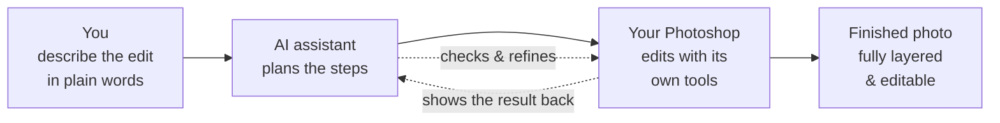

# Editmamei

**Unlock Photoshop with natural-language photo editing.**

*AI orchestration, not generation.*

*(Pronounced like* edamame*. Yes, the snack.)*

[](https://www.npmjs.com/package/editmamei)
[](https://editmamei.com/license)
[]()

You describe the edit in plain words. The AI plans the steps. Your own copy of Photoshop carries them out, using its standard adjustment layers, masks, selections, and filters. The AI directs; Photoshop edits. No generative model touches your pixels.

This repository is the **public face** of Editmamei. It hosts the user-facing documentation, the issue tracker, and the changelog. The source for the npm package itself is private; what you install from npm is the same compiled artifact described in these docs.

- **Website:** [editmamei.com](https://editmamei.com)
- **Install:** see [docs/installation.md](docs/installation.md)
- **Pro features:** see [docs/pro-features.md](docs/pro-features.md)
- **Report a bug:** [open an issue](https://github.com/editmamei/editmamei-ce/issues/new/choose)

---

## Quick install

```bash
npm install -g editmamei
editmamei install
```

`editmamei install` detects which MCP clients you have (Claude Desktop, Cursor, Claude Code) and writes the appropriate config for each — in one pass. Each client gets its own per-client result line so you can see what was touched. Then restart your AI client(s) and ask one of them to ping Photoshop:

> "Is Photoshop connected?"

You'll see your Photoshop version returned. Full setup walkthrough in [docs/getting-started.md](docs/getting-started.md). To check your install state any time, run `editmamei status`.

---

## How It Works

**You talk. Photoshop works.**

For years, getting the look in your head meant nudging sliders and hunting for a tutorial that matched your exact shot. Editmamei plugs your AI chat assistant straight into the desktop Photoshop you already have. You describe what you want in plain words, like you'd tell a friend, and it builds the layers, makes the adjustments, and hands back the finished photo.

Here's what's actually happening:

1. **You describe the edit** in plain language ("warm up the golden hour, lift the shadows, clean up the horizon").
2. **The AI plans the steps:** which adjustments, which selections, in what order.
3. **Your Photoshop does the editing** on your machine, using its own standard tools.
4. **You get a finished photo** that's fully layered, maskable, and editable. Nothing baked in.

The AI looks at the result and refines it; Photoshop performs every actual change.



### Edited, not generated

Most "AI photo" tools are *generative*. They invent new pixels: skies, objects, even faces that were never in your shot. **Editmamei doesn't do that.** It works only with the pixels you captured, using the same non-generative Photoshop tools professionals have used for years: adjustment layers, masks, selections, filters. The AI is the director, not the artist. Your photo is yours, just finished faster.

### Your files, your machine

Editmamei runs on your own computer, and the editing happens inside your own Photoshop. Editmamei itself ships no analytics, crash reports, or telemetry, and your photo files aren't uploaded to Editmamei's servers.

Worth being clear about: your AI assistant is a cloud service. When you ask it to analyze an image (for example, the visual-verification preview), a downscaled JPEG is sent to *that AI provider*, exactly as if you'd dropped the file into a chat with it. That's a property of using a cloud AI, and a function of which assistant you choose. Not a hop Editmamei adds.

---

## Requirements

- **Node.js** 20 or later
- **Adobe Photoshop** 2022 or later (2024+ recommended)
- **Operating system:** Windows 10/11 or macOS 12+
- An **AI assistant** that speaks MCP, such as Claude Desktop, Cursor, Claude Code, or any other MCP-compatible client

---

## What it does

Editmamei gives your AI assistant a working photographer's toolkit inside Photoshop. Your AI calls these as building blocks in service of whatever you actually want, so Photoshop responds to *"make the sky more dramatic but keep the foreground natural"* instead of *Layer → New Adjustment Layer → Curves → drag the curve up at the highlight end.*

- **Documents** — open, save, export, close; full format coverage (PSD, JPEG, PNG, TIFF, DNG, HEIC, raw)
- **Layers** — create, duplicate, delete, rename, reorder, group, merge, flatten; opacity, blend mode, visibility, locking
- **Smart selections** — Color Range, Magic Wand, plus rectangle/feather; rich selection feedback. Pro adds Sensei-backed Select Subject and Select Sky.
- **Non-destructive adjustments** — Curves, Levels, Hue/Saturation, Brightness/Contrast as adjustment layers
- **Filters** — Gaussian Blur, Motion Blur, Sharpen, Add Noise; layer styles (drop shadow, stroke, outer glow)
- **Templates** — apply saved recipes (markdown + before/after previews + tool-call evidence) to new images; create your own with Pro
- **Visual verification** — downscaled preview JPEGs returned inline. Pro adds per-channel histograms with mean/stdev/median.
- **History & Actions** — undo, redo, jump to state; play recorded Photoshop Actions

Real tools. Real layers. Your pixels.

Full feature breakdown at [editmamei.com](https://editmamei.com).

---

## Editions

| | Community | Pro |
|---|---|---|
| Documents (open, save, export; PSD, JPEG, PNG, TIFF, DNG, HEIC, raw) | ✅ | ✅ |
| Layers (create, duplicate, group, merge, transform, reorder, properties) | ✅ | ✅ |
| Non-destructive adjustments (Curves, Levels, Hue/Saturation, Brightness/Contrast) | ✅ | ✅ |
| Filters (Gaussian Blur, Motion Blur, Sharpen, Add Noise) | ✅ | ✅ |
| Smart selections (Color Range, Magic Wand, rectangle, feather, with rich feedback) | ✅ | ✅ |
| Masks (create from selection, apply, delete) | ✅ | ✅ |
| Layer styles + text (drop shadow, stroke, glow; font, color, alignment) | ✅ | ✅ |
| History + Actions (undo, redo, jump to state, play recorded Photoshop Actions) | ✅ | ✅ |
| Visual preview (inline JPEGs so the AI can see what just changed) | ✅ | ✅ |
| Apply saved templates | ✅ | ✅ |
| Create / save / delete custom templates | | ✅ |
| Sensei-backed selections (Select Subject, Select Sky) | | ✅ |
| Per-channel histograms | | ✅ |

Community covers the full working-photographer editing surface. Pro adds three specific upgrades: authoring your own templates, the Sensei selection models for Subject and Sky, and per-channel histograms for measuring an edit against the pixels.

What's *coming* in Pro after v1.0 (Smart Objects, Smart Filters, channels and vector masks, the rest of the adjustment-layer catalog, refined selection edges, advanced transforms) lives in [docs/roadmap.md](docs/roadmap.md), not on this table. The Pro tool list as it ships today is in [docs/pro-features.md](docs/pro-features.md). Detailed comparison and pricing at [editmamei.com/pricing](https://editmamei.com/pricing).

---

## Verifiable, not just promised

Editmamei is closed-source, so what we can verify, we do:

- **npm provenance** — every published build is cryptographically linked to the source commit and CI run that produced it.
- **SBOM** — a full software bill of materials lists every dependency in each release.
- **Abandonment → MIT** — if Editmamei goes unmaintained for 24 months, the license converts to MIT automatically. You're never stranded on a tool you can't keep alive.

The only data Editmamei itself transmits is Pro license validation: license key + version + OS, sent about once every 7 days. No document, image, file path, or template data. Full details in the [privacy policy](https://editmamei.com/privacy). Security disclosures at [editmamei.com/security](https://editmamei.com/security).

---

## Issues & support

**Bug reports and feature requests** belong in [this repo's issue tracker](https://github.com/editmamei/editmamei-ce/issues). Before opening one, please read the templates and [CONTRIBUTING.md](CONTRIBUTING.md) — they tell you what to include for a fast triage and which kinds of changes are open to PRs.

**Important:** issues are public. **Do not paste your license key, full file paths from sensitive projects, or screenshots of unfinished client work.** The bug report template tells you what's safe to share.

For account, billing, or license issues, email [support@editmamei.com](mailto:support@editmamei.com) (Pro subscribers) — those don't belong in a public issue.

For **security disclosures**, see [SECURITY.md](SECURITY.md) — please use GitHub Private Security Advisories or `security@editmamei.com` rather than the public issue tracker.

---

## Documentation

- [Installation](docs/installation.md) — setup for Windows and macOS, all supported MCP clients
- [Getting started](docs/getting-started.md) — first session, ping test, first real edit
- [Pro features](docs/pro-features.md) — what's in Pro that's not in CE, with pricing link
- [FAQ](docs/faq.md) — common questions

Full reference docs live at [editmamei.com/docs](https://editmamei.com/docs).

---

*Pairs well with: a layered PSD, a willing AI, and a small bowl of edamame.*
